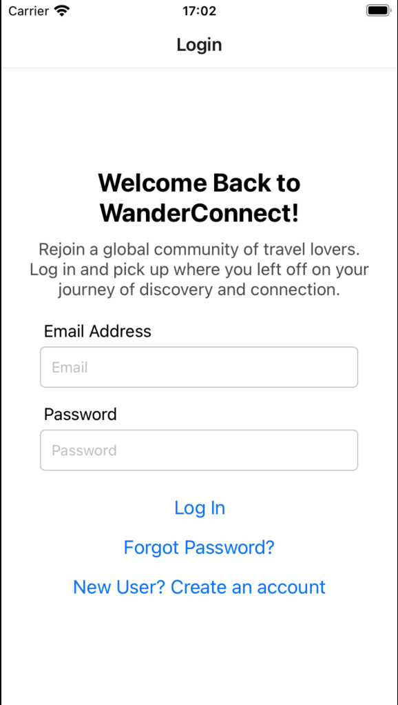
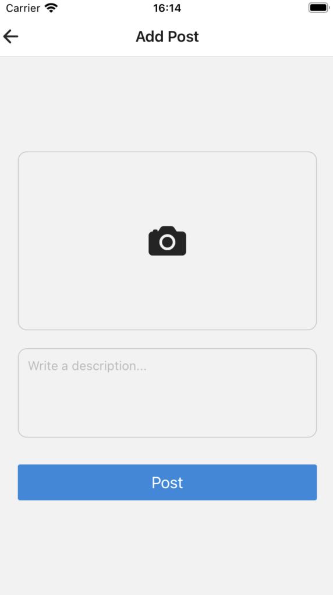

# WanderConnect App

## Overview
This project is a social networking app built with React Native and Firebase. Users can create profiles, share posts, and organize events. The app is structured to support user authentication, personalized content, and CRUD (Create, Read, Update, Delete) operations for user profiles, posts, and events.

## Firebase Rule
```
  match /Events/{event} {
      allow create,read: if request.auth!= null;
      allow update,delete: if request.auth!= null && request.auth.uid== resource.data.owner;
  }
   match /Posts/{event} {
      allow create,read: if request.auth!= null;
  }
  match /users/{user} {
      allow read, write: if request.auth!= null
  }
```

## Data Model

### 1. Users Collection
The `Users` collection stores essential information for each user, allowing for user authentication and personalized interactions.

#### Key Fields
- **name**: The user's full name, displayed on their profile.
- **age**: User’s age, useful for age-specific content.
- **sex**: User’s gender, used for personalization.
- **avatar**: URL of the user's profile picture.
- **email**, **phone**: Contact details for the user.
- **address**: User's location, adding context to social interactions.
- **description**: A brief bio or description about the user.

#### CRUD Operations
- **Create**: Add a new user profile on sign-up.
- **Read**: View user details in the `Me.js` component.
- **Update**: Allow users to edit their profiles in the app.

### 2. Posts Collection
The `Posts` collection manages user-generated content. Each post includes an image, a description, and metadata linking it to the creator.

#### Key Fields
- **image**: URL for the image associated with the post.
- **description**: Caption or text description of the post.
- **userId**: Unique identifier for the user who created the post.
- **userName**, **userAvatar**: Cached data for displaying the post author’s details, improving loading speed.

#### CRUD Operations
- **Create**: Users can create a new post via `AddPost.js`.
- **Read**: Posts can be viewed in feeds, profile views, and in components like `MyPosts.js`.

### 3. Events Collection
The `Events` collection holds data related to events created by users. This enables the app's event-sharing and scheduling functionalities.

#### Key Fields
- **title**: Name of the event.
- **description**: Detailed information about the event.
- **dateTime**: Date and time of the event.
- **location**: Text description or address of the event.
- **coordinates**: Latitude and longitude for map display.
- **owner**: Unique identifier for the event creator.

#### CRUD Operations
- **Create**: Users can add new events in `AddOrEditEvent.js`.
- **Read**: View event details in `EventDetail.js` and `EventTabs`.
- **Update**: Users can edit their events, changing details as needed.
- **Delete**: Users can delete events they’ve created.

## Components Overview

### Main Components
- **SignUp**: User sign up if there is no exist user.
- **Login**: User login if user has already registered.
- **ResetPassword**: User reset password if forget.
- **Me**: Displays user profile information.
- **MeEdit**: Allows users to edit their profile.
- **Posts**: Displays a feed of posts created by all users.
- **AddPost**: Allows users to create a new post.
- **EventDetail**: Shows detailed information about a specific event.
- **AddOrEditEvent**: Allows users to create or edit events.
- **MapAll**: Map show all events with location.

### Navigation
The app uses a combination of stack and tab navigation. The app conditionally renders either the authentication stack or the main app stack based on the user’s login status.

- **Auth Stack**: Contains login and sign-up screens.
- **App Stack**: Contains main app screens, including the bottom tab navigator with screens for `Posts`, `Events`, and `Me`.


## Contribution

### Iteration1
Wenjing Yang:

- Implement the navigation and the structure of the app.
- Implement the screens and logics: Posts, AddPost, Events, AddOrEditEvent.

Yue Xu:

- Implement the CRUD operation of Firebase and UserContext.
- Implement the screens and logics: Me, MeEdit, Signup, Login.

### Iteration2
Wenjing Yang:

- Implement sort and search functionality.
- Implement camera feature for user avatar and post.

Yue Xu:

- Implement MapAll screen for showing all events and user can check the map events.
- Implement authentication includes login, register and resetting passwords.

## Screenshots

- Login and Signup:  
  
  
   

- Posts and AddPost:  
  
  

- Events, EventDetail and AddEvent:  
  
  
  

- Me, EditMe  
  
  

- Map   
  